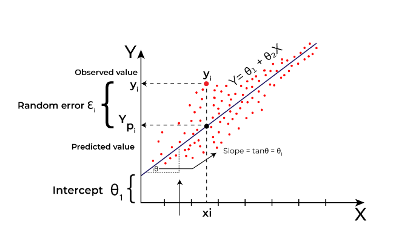
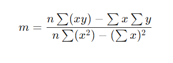
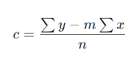

## Linear regression in machine learning

**Linear regression** is a type of machine-learning algorithm or 
a supervised machine-learning algorithm that learns from the *labelled datasets* 
and maps the data points to the most optimized linear functions. 
which can be used for prediction on new datasets. 

>**Regression:** It predicts the continuous output variables based on the independent input variable. like the prediction of house prices based on different parameters like house age, distance from the main road, location, area, etc.

---
## What it is?
 - algorithm that computes the linear relationship between the dependent variable and one or more independent features by fitting a linear equation to observed data.
 - for one independent feature it is known as simple linear regression, for multiple called multiple linear regression
 - when there is only one dependent variable, it is considered Univariate Linear Regression, while when there are more than one dependent variables, it is known as Multivariate Regression.
 

## Why is it important?
 - Linear regression is important because it’s simple, easy to understand, and it helps us learn about our data 
 - Linear regression is like the basic alphabet of machine learning. Many advanced techniques, like **regularization** (which helps prevent overfitting) and **support vector machines** (used for classification), are built on ideas from linear regression.
 - Helps Test Assumptions About Data, it can check if data has a linear relationship
 
## Types of Linear regression

 1. Simple Linear Regression: only one independent variable y=β0 +βX 
 	where: 
		- Y is the dependent variable 
		- X is the independent variable 
		- β0 is the intercept 
		- β1 is the slope 
 2. Multiple Linear Regression: Involves more than one independent variable and one dependent variable.
    y=β0 +β1 X1+β2 X2+………βn Xn 
	where: 
		- Y is the dependent variable 
		- X1, X2, …, Xn are the independent variables 
		- β0 is the intercept 
		- β1, β2, …, βn are the slopes 

**The goal of the algorithm is to find the best Fit Line equation that can predict the values based on the independent variables.**

## What is the best Fit Line?
The primary objective while using linear regression is to locate the best-fit line, which implies that the error between the predicted and actual values should be kept to a minimum. There will be the least error in the best-fit line.

## Y = Mx + c
finding the value of m 
 
finding the value of c 
 